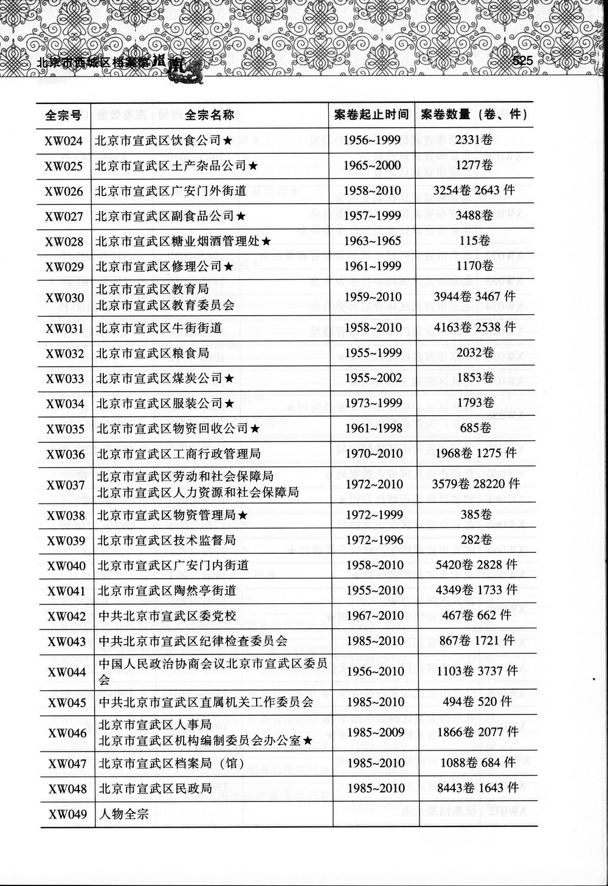

# Goal

How efficiently can we solve the use case: Convert this image to a human readable format and translate it?

Image: 

# Options

## Docling -> Qwen (55s total - Docling 30s Qwen 25s)

Docling (30s)

### Docling + Easy OCR
Convert the image to markdown: `docling --to=md --ocr-lang=en,ch_sim chinesetoc.jpg`

(This returned ch_tra characters, I think it should be ch_sim, if I run `ocr-lang=en,ch_sim` it returns the same characters at Qwen below.)

525

| 全宗號   | 全宗名稱                            | 案卷起止時間    |               |
|-------|---------------------------------|-----------|---------------|
| XW024 | 北京市宣武區飲食公司+                     | 1956~1999 | 2331卷         |
| XW025 | 北京市宣武區土產雜品公司+                   | 1965-2000 | 1277卷         |
| XW026 | 北京市宣武區廣安門外街道                    | 1958~2010 | 3254卷 2643 件  |
|       | 北京市宣武區副食品公司+                    | 1957~1999 | 3488卷         |
| XW028 |                                 | 1963~1965 |               |
| XWO29 | 北京市宣武區修理公司+                     | 1961~1999 | ll70卷         |
| XW030 | 北京市宣武區教育局 北京市宣武區教育委員會           | 1959~2010 | 3944卷 3467 件  |
| XW031 | 北京市宣武區牛街街道                      | 1958~2010 | 4163卷 2538 件  |
| XW032 | 北京市宣武區糧食局                       | 1955~1999 | 2032卷         |
| XW033 | 北京市宣武區煤炭公司+                     | 1955~2002 | 1853卷         |
| XW034 | 北京市宣武區服裝公司+                     | 1973~1999 | 1793卷         |
|       | 北京市宣武區物資回收公司+                   | 1961~1998 | 685卷          |
| XW036 | 北京市宣武區工商行政管理局                   | 1970~2010 | 1968卷 1275 件  |
| XW037 | 北京市宣武區勞動和社會保障局 北京市宣武區人力資源和社會保障局 | 1972-2010 | 3579卷 28220 件 |
| XW038 | 北京市宜武區物資管理局+                    | 1972~1999 | 385卷          |
|       | 北京市宣武區技術監督局                     | 1972~1996 | 282卷          |
| XW040 | 北京市宣武區廣安門內街道                    | 1958~2010 | 5420卷 2828 件  |
| XWO41 | 北京市宣武區陶然亭街道                     | 1955-2010 | 4349卷 1733 件  |
| XW042 | 中共北京市宣武區委黨校                     | 1967~2010 | 467卷 662 件    |
| XW043 | 中共北京市宣武區紀律檢查委員會                 | 1985-2010 | 867卷 1721 件   |
|       | 中國人民政治協商會議北京市宣武區委員              | 1956~2010 | 1103卷 3737 件  |
| XW045 |                                 | 1985-2010 | 494卷 520 件    |
| XW046 | 北京市宣武區人事局 北京市宣武區機構編制委員會辦公室+     | 1985~2009 | 1866卷 2077 件  |
| XW047 | 北京市宣武區檔案局(館)                    | 1985~2010 | 1088卷 684 件   |
|       | 北京市宣武區民政局                       | 1985~2010 | 8443卷 1643 件  |
| XW049 | 人物全宗                            |           |               |

### Docling + Tesseract

Very, very bad.

Tried with `docling --to=md --ocr-engine tesseract --output docling_output --ocr-lang=chi_tra+eng chinesetoc.jpg`

### Docling + VLM

This uses a small ML model docling created.

`docling --to=md --output docling_output --ocr-lang=en,ch_tra --pipeline=vlm chinesetoc.jpg`

Took too long, I stopped it.

### Qwen3:4b (43s)

| Fonds Number | Fonds Name | Period of File Dates |          |
|-------------|-----------|----------------------|----------|
| XW024       | Beijing Xuanwu District Food Company+ | 1956-1999 | 2331 volumes |
| XW025       | Beijing Xuanwu District Handicrafts and Commodities Company+ | 1965-2000 | 1277 volumes |
| XW026       | Beijing Xuanwu District Guanshanmenwai Street | 1958-2010 | 3254 volumes 2643 items |
|             | Beijing Xuanwu District Subfood Company+ | 1957-1999 | 3488 volumes |
| XW028       |                               | 1963-1965 |          |
| XW029       | Beijing Xuanwu District Repair Company+ | 1961-1999 | 1170 volumes |
| XW030       | Beijing Xuanwu District Education Bureau Beijing Xuanwu District Education Committee | 1959-2010 | 3944 volumes 3467 items |
| XW031       | Beijing Xuanwu District Niujie Street | 1958-2010 | 4163 volumes 2538 items |
| XW032       | Beijing Xuanwu District Grain Bureau | 1955-1999 | 2032 volumes |
| XW033       | Beijing Xuanwu District Coal Company+ | 1955-2002 | 1853 volumes |
| XW034       | Beijing Xuanwu District Apparel Company+ | 1973-1999 | 1793 volumes |
|             | Beijing Xuanwu District Materials Recycling Company+ | 1961-1998 | 685 volumes |
| XW036       | Beijing Xuanwu District Administration for Industry and Commerce | 1970-2010 | 1968 volumes 1275 items |
| XW037       | Beijing Xuanwu District Labor and Social Security Bureau Beijing Xuanwu District Human Resources and Social Security Bureau | 1972-2010 | 3579 volumes 28220 items |
| XW038       | Beijing Xuanwu District Materials Administration Bureau+ | 1972-1999 | 385 volumes |
|             | Beijing Xuanwu District Technical Supervision Bureau | 1972-1996 | 282 volumes |
| XW040       | Beijing Xuanwu District Guanshanmennei Street | 1958-2010 | 5420 volumes 2828 items |
| XW041       | Beijing Xuanwu District Taoranting Street | 1955-2010 | 4349 volumes 1733 items |
| XW042       | Beijing Xuanwu District Party School | 1967-2010 | 467 volumes 662 items |
| XW043       | Beijing Xuanwu District Discipline Inspection Commission | 1985-2010 | 867 volumes 1721 items |
|             | Chinese People's Political Consultative Conference Beijing Xuanwu District Committee | 1956-2010 | 1103 volumes 3737 items |
| XW045       |                               | 1985-2010 | 494 volumes 520 items |
| XW046       | Beijing Xuanwu District Personnel Bureau Beijing Xuanwu District Institutional Compilation Committee Office+ | 1985-2009 | 1866 volumes 2077 items |
| XW047       | Beijing Xuanwu District Archives Bureau (Archive) | 1985-2010 | 1088 volumes 684 items |
|             | Beijing Xuanwu District Civil Affairs Bureau | 1985-2010 | 8443 volumes 1643 items |
| XW049       | Personal Fonds |           |          |

### Qwen3 30B-A3B (No Thinking) (25s)

`ollama run --verbose hf.co/unsloth/Qwen3-30b-A3B-GGUF:Q4_K_XL "Translate this markdown table to english /no_think: " < chinesetoc.md > docling-qwen-30ba3b-nothink.md`

| Fonds Number | Fonds Name                                      | File Start-End Date |               |
|--------------|-------------------------------------------------|---------------------|---------------|
| XW024        | Beijing Xuanwu District Catering Company+        | 1956~1999           | 2331 files    |
| XW025        | Beijing Xuanwu District Agricultural Products Company+ | 1965-2000           | 1277 files    |
| XW026        | Beijing Xuanwu District Guang'anmen Outer Street | 1958~2010           | 3254 files 2643 items |
|              | Beijing Xuanwu District Subsistence Products Company+ | 1957~1999           | 3488 files    |
| XW028        |                                                 | 1963~1965           |               |
| XWO29        | Beijing Xuanwu District Repair Company+          | 1961~1999           | ll70 files    |
| XW030        | Beijing Xuanwu District Education Bureau Beijing Xuanwu District Education Committee | 1959~2010           | 3944 files 3467 items |
| XW031        | Beijing Xuanwu District Niujie Street            | 1958~2010           | 4163 files 2538 items |
| XW032        | Beijing Xuanwu District Grain Bureau             | 1955~1999           | 2032 files    |
| XW033        | Beijing Xuanwu District Coal Company+            | 1955~2002           | 1853 files    |
| XW034        | Beijing Xuanwu District Clothing Company+        | 1973~1999           | 1793 files    |
|              | Beijing Xuanwu District Material Recycling Company+ | 1961~1998           | 685 files     |
| XW036        | Beijing Xuanwu District Administration for Industry and Commerce | 1970~2010           | 1968 files 1275 items |
| XW037        | Beijing Xuanwu District Human Resources and Social Security Bureau Beijing Xuanwu District Human Resources and Social Security Bureau | 1972-2010           | 3579 files 28220 items |
| XW038        | Beijing Xuanwu District Material Bureau+          | 1972~1999           | 385 files     |
|              | Beijing Xuanwu District Technical Supervision Bureau | 1972~1996           | 282 files     |
| XW040        | Beijing Xuanwu District Guang'anmen Inner Street | 1958~2010           | 5420 files 2828 items |
| XWO41        | Beijing Xuanwu District Taoran Pavilion Street   | 1955-2010           | 4349 files 1733 items |
| XW042        | CPC Beijing Xuanwu District Party School         | 1967~2010           | 467 files 662 items |
| XW043        | CPC Beijing Xuanwu District Discipline Inspection Commission | 1985-2010           | 867 files 1721 items |
|              | Chinese People's Political Consultative Conference Beijing Xuanwu District Committee | 1956~2010           | 1103 files 3737 items |
| XW045        |                                                 | 1985-2010           | 494 files 520 items |
| XW046        | Beijing Xuanwu District Personnel Bureau Beijing Xuanwu District Institutional Compilation Committee Office+ | 1985~2009           | 1866 files 2077 items |
| XW047        | Beijing Xuanwu District Archives Bureau (Museum) | 1985~2010           | 1088 files 684 items |
|              | Beijing Xuanwu District Civil Affairs Bureau     | 1985~2010           | 8443 files 1643 items |
| XW049        | Personal Fonds                                   |                     |               |

## One Shot Mistral Small (1 minute, 24 seconds)

`ollama run --verbose mistral-small3.1:24b "Extract the text from this image and convert it to markdown. For any text not in english, add a translation to english parenthesis next to it: ./chinesetoc.jpg"`


Here is the text from the image converted to markdown with translations for the non-English text:

# 北京市宣武区档案馆藏文书目录（二十五） (Beijing Xuanwu District Archives Catalog (Twenty-Five))

| 全宗号 (Catalog Number) | 全宗名称 (Catalog Name) | 案卷起止时间 (Time Range of Records) | 案卷数量 (Number of Records) |
|--------------------------|--------------------------|--------------------------------------|------------------------------|
| XW024                    | 北京市宣武区食品公司 (Beijing Xuanwu District Food Company) ★ | 1956–1999 | 2331卷 (2331 volumes) |
| XW025                    | 北京市宣武区土产品公司 (Beijing Xuanwu District Native Products Company) ★ | 1965–2000 | 1277卷 (1277 volumes) |
| XW026                    | 北京市宣武区广安门外街道 (Beijing Xuanwu District Guang'anmenwai Street) | 1958–2010 | 3254卷 2643件 (3254 volumes 2643 items) |
| XW027                    | 北京市宣武区副食品公司 (Beijing Xuanwu District Subsidiary Food Company) ★ | 1957–1999 | 3488卷 (3488 volumes) |
| XW028                    | 北京市宣武区糖业烟酒管理处 (Beijing Xuanwu District Sugar, Tobacco, and Alcohol Management Office) ★ | 1963–1965 | 115卷 (115 volumes) |
| XW029                    | 北京市宣武区修理公司 (Beijing Xuanwu District Repair Company) ★ | 1961–1999 | 1170卷 (1170 volumes) |
| XW030                    | 北京市宣武区教育局 (Beijing Xuanwu District Education Bureau) <br> 北京市宣武区教育委员会 (Beijing Xuanwu District Education Committee) | 1959–2010 | 3944卷 3467件 (3944 volumes 3467 items) |
| XW031                    | 北京市宣武区牛街街道 (Beijing Xuanwu District Niujie Street) | 1958–2010 | 4163卷 2538件 (4163 volumes 2538 items) |
| XW032                    | 北京市宣武区粮食局 (Beijing Xuanwu District Food Bureau) | 1955–1999 | 2032卷 (2032 volumes) |
| XW033                    | 北京市宣武区煤炭公司 (Beijing Xuanwu District Coal Company) | 1955–2002 | 1853卷 (1853 volumes) |
| XW034                    | 北京市宣武区服装公司 (Beijing Xuanwu District Garment Company) ★ | 1973–1999 | 1793卷 (1793 volumes) |
| XW035                    | 北京市宣武区物资回收公司 (Beijing Xuanwu District Materials Recovery Company) ★ | 1961–1998 | 685卷 (685 volumes) |
| XW036                    | 北京市宣武区工商行政管理局 (Beijing Xuanwu District Administration for Industry and Commerce) | 1970–2010 | 1968卷 1275件 (1968 volumes 1275 items) |
| XW037                    | 北京市宣武区劳动和社会保障局 (Beijing Xuanwu District Labor and Social Security Bureau) <br> 北京市宣武区人力资源和社会保障局 (Beijing Xuanwu District Human Resources and Social Security Bureau) | 1972–2010 | 3579卷 28220件 (3579 volumes 28220 items) |
| XW038                    | 北京市宣武区物资管理局 (Beijing Xuanwu District Materials Management Bureau) ★ | 1972–1999 | 385卷 (385 volumes) |
| XW039                    | 北京市宣武区技术监督局 (Beijing Xuanwu District Technical Supervision Bureau) | 1972–1996 | 282卷 (282 volumes) |
| XW040                    | 北京市宣武区广安门内街道 (Beijing Xuanwu District Guang'anmen Nei Street) | 1958–2010 | 5420卷 2828件 (5420 volumes 2828 items) |
| XW041                    | 北京市宣武区崇阳街道 (Beijing Xuanwu District Chongyang Street) | 1955–2010 | 4349卷 1733件 (4349 volumes 1733 items) |
| XW042                    | 中共北京市宣武区委员会 (Communist Party of China Beijing Xuanwu District Committee) | 1967–2010 | 467卷 662件 (467 volumes 662 items) |
| XW043                    | 中共北京市宣武区纪律检查委员会 (Communist Party of China Beijing Xuanwu District Discipline Inspection Commission) | 1985–2010 | 867卷 1721件 (867 volumes 1721 items) |
| XW044                    | 中国人民政治协商会议北京市宣武区委员会 (Chinese People's Political Consultative Conference Beijing Xuanwu District Committee) | 1956–2010 | 1103卷 3737件 (1103 volumes 3737 items) |
| XW045                    | 中共北京市宣武区直属机关工作委员会 (Communist Party of China Beijing Xuanwu District Directly Affiliated Institutions Work Committee) | 1985–2010 | 494卷 520件 (494 volumes 520 items) |
| XW046                    | 北京市宣武区人事局 (Beijing Xuanwu District Personnel Bureau) <br> 北京市宣武区机构编制委员会办公室 (Beijing Xuanwu District Organization and Staffing Commission Office) ★ | 1985–2009 | 1866卷 2077件 (1866 volumes 2077 items) |
| XW047                    | 北京市宣武区档案局 (Beijing Xuanwu District Archives Bureau) | 1985–2010 | 1088卷 684件 (1088 volumes 684 items) |
| XW048                    | 北京市宣武区民政局 (Beijing Xuanwu District Civil Affairs Bureau) | 1985–2010 | 8443卷 1643件 (8443 volumes 1643 items) |
| XW049                    | 人物全宗 (Individuals Catalog) |  |  |

## One shot Qwen 2.5 VL-7B-Instruct (1:15)

Ollama can't run this model yet. Running with llama-cli:

```
llama-mtmd-cli -hf ggml-org/Qwen2.5-VL-7B-Instruct-GGUF --image chinesetoc.jpg -p "Extract the text from this image and convert it to markdown. For any text not in english, add a translation to english in parenthesis next to it." > 7b-instruct.md
```

| 全宗号 | 全宗名称 | 案卷起止时间 | 案卷数量（卷、件） |
| --- | --- | --- | --- |
| XW024 | 北京市宣武区饮食公司★ | 1956~1999 | 2331卷 |
| XW025 | 北京市宣武区土产杂品公司★ | 1965~2000 | 1277卷 |
| XW026 | 北京市宣武区广安门外街道 | 1958~1999 | 3488卷 |
| XW027 | 北京市宣武区副食品公司★ | 1957~2010 | 115卷 |
| XW028 | 北京市宣武区糖业烟酒管理处★ | 1963~1965 | 115卷 |
| XW029 | 北京市宣武区修理公司★ | 1961~1999 | 1170卷 |
| XW030 | 北京市宣武区教育局 | 1958~2010 | 4163卷 2538 件 |
| XW031 | 北京市宣武区牛街街道 | 1955~1999 | 3254卷 2643 件 |
| XW032 | 北京市宣武区粮食局 | 1958~2010 | 1853卷 |
| XW033 | 北京市宣武区煤炭公司★ | 1957~1999 | 1793卷 |
| XW034 | 北京市宣武区服装公司★ | 1961~1998 | 685卷 |
| XW035 | 北京市宣武区物资回收公司★ | 1963~2002 | 1968卷 1275 件 |
| XW036 | 北京市宣武区工商行政管理局 | 1970~2010 | 1968卷 1275 件 |
| XW037 | 北京市宣武区劳动和社会保障局 | 1972~2010 | 3579卷 28220 件 |
| XW038 | 北京市宣武区物资管理局★ | 1972~1999 | 385卷 |
| XW039 | 北京市宣武区技术监督局 | 1972~1996 | 282卷 |
| XW040 | 北京市宣武区广安门内街道 | 1958~2010 | 5420卷 2828 件 |
| XW041 | 北京市宣武区陶然亭街道 | 1972~2010 | 3579卷 28220 件 |
| XW042 | 中共北京市宣武区人事局 | 1972~1999 | 385卷 |
| XW043 | 中共北京市宣武区技术监督局 | 1972~1996 | 282卷 |
| XW044 | 中共北京市宣武区纪律检查委员会 | 1958~2010 | 5420卷 2828 件 |
| XW045 | 中共北京市宣武区直属机关工作委员会 | 1972~1999 | 385卷 |
| XW046 | 北京市宣武区人事局 | 1967~2010 | 282卷 |
| XW047 | 中共北京市宣武区机构编制委员会办公室★ | 1967~2010 | 467卷 662 件 |
| XW048 | 北京市宣武区档案局（馆） | 1985~2010 | 867卷 1721 件 |
| XW049 | 中国人民政治协商会议北京市宣武区委员会 | 1956~2010 | 4349卷 1733 件 |
| XW050 | 中共北京市宣武区直属机关工作委员会 | 1985~2010 | 494卷 520 件 |
| XW051 | 北京市宣武区人事局 | 1967~2009 | 282卷 |
| XW052 | 北京市宣武区机构编制委员会办公室★ | 1967~2010 | 467卷 662 件 |
| XW053 | 北京市宣武区档案局（馆） | 1985~2010 | 867卷 1721 件 |
| XW054 | 中国人民政治协商会议北京市宣武区委员会 | 1956~2010 | 4349卷 1733 件 |
| XW055 | 中共北京市宣武区直属机关工作委员会 | 1985~2010 | 494卷 520 件 |
| XW056 | 北京市宣武区人事局 | 1967~2009 | 282卷 |
| XW057 | 北京市宣武区机构编制委员会办公室★ | 1967~2010 | 467卷 662 件 |
| XW058 | 北京市宣武区档案局（馆） | 1985~2010 | 867卷 1721 件 |
| XW059 | 中国人民政治协商会议北京市宣武区委员会 | 1956~2010 | 4349卷 1733 件 |
| XW060 | 中共北京市宣武区直属机关工作委员会 | 1985~2010 | 494卷 520 件 |
| XW061 | 北京市宣武区人事局 | 1967~2009 | 282卷 |
| XW062 | 北京市宣武区机构编制委员会办公室★ | 1967~2010 | 467卷 662 件 |
| XW063 | 北京市宣武区档案局（馆） | 1985~2010 | 867卷 1721 件 |
| XW064 | 中国人民政治协商会议北京市宣武区委员会 | 1956~2010 | 4349卷 1733 件 |
| XW065 | 中共北京市宣武区直属机关工作委员会 | 1985~2010 | 494卷 520 件 |
| XW066 | 北京市宣武区人事局 | 1967~2009 | 282卷 |
| XW067 | 北京市宣武区机构编制委员会办公室★ | 1967~2010 | 467卷 662 件 |
| XW068 | 北京市宣武区档案局（馆） | 1985~2010 | 867卷 1721 件 |
| XW069 | 中国人民政治协商会议北京市宣武区委员会 | 1956~2010 | 4349卷 1733 件 |
| XW070 | 中共北京市宣武区直属机关工作委员会 | 1985~2010 | 494卷 520 件 |
| XW071 | 北京市宣武区人事局 | 1967~2009 | 282卷 |
| XW072 | 北京市宣武区机构编制委员会办公室★ | 1967~2010 | 467卷 662 件 |
| XW073 | 北京市宣武区档案局（馆） | 1985~2010 | 867卷 1721 件 |
| XW074 | 中国人民政治协商会议北京市宣武区委员会 | 1956~2010 | 4349卷 1733 件 |
| XW075 | 中共北京市宣武区直属机关工作委员会 | 1985~2010 | 494卷 520 件 |
| XW076 | 北京市宣武区人事局 | 1967~2009 | 282卷 |
| XW077 | 北京市宣武区机构编制委员会办公室★ | 1967~2010 | 467卷 662 件 |
| XW078 | 北京市宣武区档案局（馆） | 1985~2010 | 867卷 1721 件 |
| XW079 | 中国人民政治协商会议北京市宣武区委员会 | 1956~2010 | 4349卷 1733 件 |
| XW080 | 中共北京市宣武区直属机关工作委员会 | 1985~2010 | 494卷 520 件 |
| XW081 | 北京市宣武区人事局 | 1967~2009 | 282卷 |
| XW082 | 北京市宣武区机构编制委员会办公室★ | 1967~2010 | 467卷 662 件 |
| XW083 | 北京市宣武区档案局（馆） | 1985~2010 | 867卷 1721 件 |
| XW084 | 中国人民政治协商会议北京市宣武区委员会 | 1956~2010 | 4349卷 1733 件 |
| XW085 | 中共北京市宣武区直属机关工作委员会 | 1985~2010 | 494卷 520 件 |
| XW086 | 北京市宣武区人事局 | 1967~2009 | 282卷 |
| XW087 | 北京市宣武区机构编制委员会办公室★ | 1967~2010 | 467卷 662 件 |
| XW088 | 北京市宣武区档案局（馆） | 1985~2010 | 867卷 1721 件 |
| XW089 | 中国人民政治协商会议北京市宣武区委员会 | 1956~2010 | 4349卷 1733 件 |
| XW090 | 中共北京市宣武区直属机关工作委员会 | 1985~2010 | 494卷 520 件 |
| XW091 | 北京市宣武区人事局 | 1967~2009 | 282卷 |
| XW092 | 北京市宣武区机构编制委员会办公室★ | 1967~2010 | 467卷 662 件 |
| XW093 | 北京市宣武区档案局（馆） | 1985~2010 | 867卷 1721 件 |
| XW094 | 中国人民政治协商会议北京市宣武区委员会 | 1956~2010 | 4349卷 1733 件 |
| XW095 | 中共北京市宣武区直属机关工作委员会 | 1985~2010 | 494卷 520 件 |
| XW096 | 北京市宣武区人事局 | 1967~2009 | 282卷 |
| XW097 | 北京市宣武区机构编制委员会办公室★ | 1967~2010 | 467卷 662 件 |
| XW098 | 北京市宣武区档案局（馆） | 1985~2010 | 867卷 1721 件 |
| XW099 | 中国人民政治协商会议北京市宣武区委员会 | 1956~2010 | 4349卷

## One shot Qwen 2.5 VL-32B-Instruct (2:06)

`llama-mtmd-cli -hf ggml-org/Qwen2.5-VL-32B-Instruct-GGUF --image chinesetoc.jpg -p "Extract the text from this image and convert it to markdown. For any text not in english, add a translation to english in parenthesis next to it." > 32b-instruct.md`


### 北京市西城区档案馆 (Beijing Xicheng District Archives)

| 全宗号 (Case Number) | 全宗名称 (Case Name) | 案卷起止时间 (Time Range of Files) | 案卷数量 (卷、件) (Number of Files (Volumes, Items)) |
|-----------------------|-----------------------|-------------------------------------|-----------------------------------------------|
| XW024                 | 北京市宣武区饮食公司 (Beijing Xuanwu District Catering Company) | 1956~1999                              | 2331卷 (2331 volumes)                      |
| XW025                 | 北京市宣武区土产杂品公司 (Beijing Xuanwu District General Merchandise Company) | 1965~2000                              | 1277卷 (1277 volumes)                      |
| XW026                 | 北京市宣武区广安门外街道 (Beijing Xuanwu District Guang'anmen Outer Street) | 1958~2010                              | 3254卷 2643件 (3254 volumes, 2643 items)    |
| XW027                 | 北京市宣武区副食品公司 (Beijing Xuanwu District Grocery Company) | 1957~1999                              | 3488卷 (3488 volumes)                      |
| XW028                 | 北京市宣武区糖业烟酒管理处 (Beijing Xuanwu District Sugar, Tobacco, and Alcohol Management Office) | 1963~1965                              | 115卷 (115 volumes)                        |
| XW029                 | 北京市宣武区修理公司 (Beijing Xuanwu District Repair Company) | 1961~1999                              | 1170卷 (1170 volumes)                      |
| XW030                 | 北京市宣武区教育局 (Beijing Xuanwu District Education Bureau) | 1959~2010                              | 3944卷 3467件 (3944 volumes, 3467 items)    |
| XW031                 | 北京市宣武区牛街街道 (Beijing Xuanwu District Niujie Street) | 1958~2010                              | 1793卷 (1793 volumes)                      |
| XW032                 | 北京市宣武区粮食局 (Beijing Xuanwu District Grain Bureau) | 1955~1999                              | 4163卷 2538件 (4163 volumes, 2538 items)    |
| XW033                 | 北京市宣武区煤炭公司 (Beijing Xuanwu District Coal Company) | 1973~1999                              | 1983卷 (1983 volumes)                      |
| XW034                 | 北京市宣武区服装公司 (Beijing Xuanwu District Clothing Company) | 1957~1999                              | 2032卷 (2032 volumes)                      |
| XW035                 | 北京市宣武区物资回收公司 (Beijing Xuanwu District Material Recovery Company) | 1961~1998                              | 685卷 (685 volumes)                        |
| XW036                 | 北京市宣武区工商行政管理局 (Beijing Xuanwu District Administration for Industry and Commerce) | 1970~2010                              | 1968卷 1275件 (1968 volumes, 1275 items)    |
| XW037                 | 北京市宣武区劳动和社会保障局 (Beijing Xuanwu District Labor and Social Security Bureau) | 1955~2010                              | 3579卷 2820件 (3579 volumes, 2820 items)    |
| XW038                 | 北京市宣武区陶然亭街道 (Beijing Xuanwu District Taoranting Street) | 1972~1999                              | 4349卷 1733件 (4349 volumes, 1733 items)    |
| XW039                 | 北京市宣武区技术监督局 (Beijing Xuanwu District Technical Supervision Bureau) | 1967~2010                              | 467卷 662件 (467 volumes, 662 items)        |
| XW040                 | 北京市宣武区广安门内街道 (Beijing Xuanwu District Guang'anmen Inner Street) | 1958~2010                              | 1088卷 684件 (1088 volumes, 684 items)      |
| XW041                 | 北京市宣武区人事局 (Beijing Xuanwu District Personnel Bureau) | 1955~2009                              | 1866卷 2077件 (1866 volumes, 2077 items)    |
| XW042                 | 中共北京市宣武区委党校 (Communist Party of China Beijing Xuanwu District Party School) | 1972~1996                              | 282卷 (282 volumes)                        |
| XW043                 | 中共北京市宣武区纪律检查委员会 (Communist Party of China Beijing Xuanwu District Discipline Inspection Commission) | 1985~2010                              | 867卷 1721件 (867 volumes, 1721 items)      |
| XW044                 | 中国人民政治协商会议北京市宣武区委员会 (Chinese People's Political Consultative Conference Beijing Xuanwu District Committee) | 1985~2010                              | 1103卷 3737件 (1103 volumes, 3737 items)    |
| XW045                 | 中共北京市宣武区直属机关工作委员会 (Communist Party of China Beijing Xuanwu District Directly Affiliated Organs Work Committee) | 1985~2010                              | 494卷 520件 (494 volumes, 520 items)        |
| XW046                 | 北京市宣武区机构编制委员会办公室 (Beijing Xuanwu District Institutional Compilation Committee Office) | 1985~2010                              | 8443卷 1643件 (8443 volumes, 1643 items)    |
| XW047                 | 北京市宣武区档案局 (馆) (Beijing Xuanwu District Archives Bureau (Museum)) | 1985~2010                              | 人物全宗 (Personnel Records)                |
| XW048                 | 北京市宣武区民政局 (Beijing Xuanwu District Civil Affairs Bureau) | 1985~2010                              | 1088卷 684件 (1088 volumes, 684 items)      |
| XW049                 | 人物全宗 (Personnel Records) | -                                     | -                                         |


## One shot gemma3:12b (51s)


Here's the extracted text from the image, formatted as Markdown, with translations for non-English terms:

**北京市互联网企业数据 (Beijing Internet Enterprise Data)**

| 全景号 (Scenic Number) | 全景号名称 (Scenic Name) | 起始时间 (Start Time) | 结束时间 (End Time) | 影像数量 (Number of Images) |
|---|---|---|---|---|
| XW024 | 北京市武陟县农贷公司 (Beijing Wudun County Agricultural Credit Company) | 1956 - 1999 | 2331 份 (copies) |
| XW025 | 北京市武陟县产麻公司 (Beijing Wudun County Hemp Production Company) | 1965 - 2000 | 1277 份 (copies) |
| XW026 | 北京市武陟县广红街道 (Beijing Wudun County Guanghong Street) | 1958 - 2010 | 3254 份 (copies) |
| XW027 | 北京市武陟县圆盘公司 (Beijing Wudun County Round Disc Company) | 1957 - 1999 | 3488 份 (copies) |
| XW028 | 北京市武陟县规划管理处 (Beijing Wudun County Planning Management Office) | 1963 - 1965 | 115 份 (copies) |
| XW029 | 北京市武陟县修理公司 (Beijing Wudun County Repair Company) | 1961 - 1999 | 1170 份 (copies) |
| XW030 | 北京市武陟县教育局 (Beijing Wudun County Education Bureau) | 1959 - 2010 | 3944 份 (copies) |
| XW031 | 北京市武陟县供养团 (Beijing Wudun County Nourishing Group) | 1958 - 2010 | 4163 份 (copies) |
| XW032 | 北京市武陟县粮食局 (Beijing Wudun County Grain Bureau) | 1955 - 1999 | 2032 份 (copies) |
| XW033 | 北京市武陟县煤炭公司 (Beijing Wudun County Coal Company) | 1955 - 2002 | 1853 份 (copies) |
| XW034 | 北京市武陟县服装公司 (Beijing Wudun County Clothing Company) | 1973 - 1999 | 1793 份 (copies) |
| XW035 | 北京市武陟县物资回收公司 (Beijing Wudun County Material Recycling Company) | 1961 - 1998 | 685 份 (copies) |
| XW036 | 北京市武陟县工商管理局 (Beijing Wudun County Commerce Management Bureau) | 1970 - 1999 | 1968 份 (copies) |
| XW037 | 北京市武陟县劳动和社会保障局 (Beijing Wudun County Labor and Social Security Bureau) | 1972 - 2010 | 3579 份 (copies) |
| XW038 | 北京市武陟县文物管理局 (Beijing Wudun County Cultural Relic Management Bureau) | 1972 - 1999 | 385 份 (copies) |
| XW039 | 北京市武陟县水利局 (Beijing Wudun County Water Conservancy Bureau) | 1968 - 2000 | 282 份 (copies) |
| XW040 | 北京市武陟县广红街道 (Beijing Wudun County Guanghong Street) | 1963 - 2010 | 5409 份 (copies) |
| XW041 | 北京市武陟县医院 (Beijing Wudun County Hospital) | 1958 - 1999 | 4288 份 (copies) |
| XW042 | 中共北京市武陟县委 (Beijing Wudun County CPC Committee) | 1957 - 2000 | 4468 份 (copies) |
| XW043 | 北京市武陟县交通运输公司 (Beijing Wudun County Transportation Company) | 1955 - 1999 | 1988 份 (copies) |
| XW044 | 北京市武陟县汽车公司 (Beijing Wudun County Automobile Company) | 1968 - 1999 | 1768 份 (copies) |
| XW045 | 北京市武陟县电力公司 (Beijing Wudun County Power Company) | 1955 - 2000 | 1886 份 (copies) |
| XW046 | 北京市武陟县水电公司 (Beijing Wudun County Hydropower Company) | 1958 - 1999 | 1870 份 (copies) |
| XW047 | 北京市武陟县农产品公司 (Beijing Wudun County Agricultural Products Company) | 1962 - 1998 | 1461 份 (copies) |
| XW048 | 北京市武陟县建材公司 (Beijing Wudun County Building Materials Company) | 1958 - 2000 | 1075 份 (copies) |
| XW049 | 北京市武陟县化肥公司 (Beijing Wudun County Fertilizer Company) | 1956 - 1999 | 1066 份 (copies) |
| XW050 | 北京市武陟县自来水公司 (Beijing Wudun County Tap Water Company) | 1956 - 1999 | 994 份 (copies) |

**Note:** The parenthesis after each term in Chinese provides its English translation.

## One shot gemma3:27b (1:28)


Okay, here's the extracted text from the image, converted to Markdown format, with translations for any non-English text:

## 北京市海淀区档案局 (Beijing Haidian District Archives Bureau)

| 编号 (No.) | 全局名称 (Full Name) | 采集起止时间 (Collection Period) | 采集卷数 (Number of Files) |
|---|---|---|---|
| XW024 | 北京市海淀区档案局 (Beijing Haidian District Archives Bureau) | 1956-1999 | 2331卷 (Volume) |
| XW025 | 北京市海淀区丰实换届公司 (Beijing Haidian District Fengshi Renewal Company) | 1965-2000 | 1277卷 |
| XW026 | 北京市海淀区厂务街道 (Beijing Haidian District Changwu Street) | 1958-2010 | 3254卷 2643 件 (Pieces) |
| XW027 | 北京市海淀区制盒公司 (Beijing Haidian District Box Making Company) | 1957-1999 | 3488卷 |
| XW028 | 北京市海淀区棉业烟酒管理处 (Beijing Haidian District Cotton and Tobacco Alcohol Management Bureau) | 1963-1965 | 115卷 |
| XW029 | 北京市海淀区修埋公司 (Beijing Haidian District Repair and Burial Company) | 1961-1999 | 1170卷 |
| XW030 | 北京市海淀区教育局 (Beijing Haidian District Education Bureau) | 1959-2010 | 3944卷 3467 件 |
| XW031 | 北京市海淀区上地街道 (Beijing Haidian District Shangdi Street) | 1958-2010 | 4163卷 2538 件 |
| XW032 | 北京市海淀区粮食局 (Beijing Haidian District Grain Bureau) | 1955-1999 | 2032卷 |
| XW033 | 北京市海淀区煤炭公司 (Beijing Haidian District Coal Company) | 1955-2002 | 1853卷 |
| XW034 | 北京市海淀区服装公司 (Beijing Haidian District Clothing Company) | 1973-1999 | 1793卷 |
| XW035 | 北京市海淀区物资回收公司 (Beijing Haidian District Material Recycling Company) | 1961-1998 | 685卷 |
| XW036 | 北京市海淀区工商管理局 (Beijing Haidian District Administration for Industry and Commerce) | 1970-2010 | 1968卷 1275 件 |
| XW037 | 北京市海淀区劳动和社会保障局 (Beijing Haidian District Labor and Social Security Bureau) | 1972-2010 | 3579卷 28220 件 |
| XW038 | 北京市海淀区物资管理局 (Beijing Haidian District Material Management Bureau) | 1972-1999 | 385卷 |
| XW039 | 北京市海淀区木地板局 (Beijing Haidian District Wood Flooring Bureau) | 1972-1996 | 282卷 |
| XW040 | 北京市海淀区“红门”内街道 (Beijing Haidian District “Hongmen” Inner Street) | 1958-2010 | 5420卷 2328 件 |
| XW041 | 北京市海淀区陶瓷销售街 (Beijing Haidian District Ceramic Sales Street) | 1965-2002 | 4349卷 1833 件 |
| XW042 | 中共北京市海淀区委员会 (Communist Party of China Haidian District Committee) | 1957-2010 | 4661卷 4447 件 |
| XW043 | 北京市海淀区总工会 (Beijing Haidian District Federation of Trade Unions) | 1958-2010 | 4207卷 2793 件 |
| XW044 | 北京市海淀区妇联 (Beijing Haidian District Women's Federation) | 1961-2010 | 3999卷 2477 件 |
| XW045 | 北京市海淀区残疾人联合会 (Beijing Haidian District Disabled Persons' Federation) | 1985-2010 | 1144卷 1045 件 |
| XW046 | 北京市海淀区退役军人事业局 (Beijing Haidian District Veterans Affairs Bureau) | 1978-2010 | 1131卷 1011 件 |
| XW047 | 北京市海淀区老龄化社会服务中心 (Beijing Haidian District Aging Society Service Center) | 1995-2010 | 686卷 |

**Notes:**

*   `件` (Jian) often refers to "items" or "cases/files".
*   `卷` (Juan) refers to "volume" or "file".

Let me know if you would like any specific information extracted or formatted differently.

## Comparison w/ API: Gemini 2.5 Flash (13s)

**Considering Markdown Conversion**

I'm currently focused on transforming the OCR output into a Markdown table. My immediate goal is to pinpoint the table's structure – identifying headers and individual data points. Following that, I'll be integrating the translation of Chinese text into English, aiming for a seamless display.


**Mapping Data Elements**

I've started by identifying table headers and individual data entries within the OCR text. The next step is to filter and detect any Chinese characters. Once detected, I intend to integrate the translation into each data cell, ensuring that the translated text is clearly denoted, possibly through parentheses.


# 档案列表 (Archival List)

| 全宗号 (Archival Number) | 全宗名称 (Archival Title)                                                                  | 案卷起止时间 (Start and End Time of Case Files) | 案卷数量 (卷、件) (Number of Case Files (volumes, items)) |
| :----------------------- | :----------------------------------------------------------------------------------------- | :--------------------------------------------- | :---------------------------------------------- |
| XW024                    | 北京市宣武区饮食公司★ (Beijing Xuanwu District Catering Company★)                          | 1956~1999                                      | 2331卷 (volumes)                                |
| XW025                    | 北京市宣武区土产杂品公司★ (Beijing Xuanwu District Local Products and Sundries Company★)  | 1965~2000                                      | 1277卷 (volumes)                                |
| XW026                    | 北京市宣武区广安门外街道 (Beijing Xuanwu District Guang'anmenwai Subdistrict)             | 1958~2010                                      | 3254卷 (volumes) 2643件 (items)                  |
| XW027                    | 北京市宣武区副食品公司★ (Beijing Xuanwu District Non-staple Food Company★)                | 1957~1999                                      | 3488卷 (volumes)                                |
| XW028                    | 北京市宣武区糖业烟酒管理处★ (Beijing Xuanwu District Sugar, Tobacco, and Alcohol Management Office★) | 1963-1965                                      | 115卷 (volumes)                                 |
| XW029                    | 北京市宣武区修理公司★ (Beijing Xuanwu District Repair Company★)                           | 1961~1999                                      | 1170卷 (volumes)                                |
| XW030                    | 北京市宣武区教育局 (Beijing Xuanwu District Education Bureau)<br>北京市宣武区教育委员会 (Beijing Xuanwu District Education Committee) | 1959~2010                                      | 3944卷 (volumes) 3467件 (items)                  |
| XW031                    | 北京市宣武区牛街街道 (Beijing Xuanwu District Niu Street Subdistrict)                      | 1958~2010                                      | 4163卷 (volumes) 2538件 (items)                  |
| XW032                    | 北京市宣武区粮食局 (Beijing Xuanwu District Grain Bureau)                                  | 1955~1999                                      | 2032卷 (volumes)                                |
| XW033                    | 北京市宣武区煤炭公司★ (Beijing Xuanwu District Coal Company★)                             | 1955~2002                                      | 1853卷 (volumes)                                |
| XW034                    | 北京市宣武区服装公司★ (Beijing Xuanwu District Garment Company★)                          | 1973~1999                                      | 1793卷 (volumes)                                |
| XW035                    | 北京市宣武区物资回收公司★ (Beijing Xuanwu District Material Recycling Company★)           | 1961~1998                                      | 685卷 (volumes)                                 |
| XW036                    | 北京市宣武区工商行政管理局 (Beijing Xuanwu District Administration for Industry and Commerce) | 1970~2010                                      | 1968卷 (volumes) 1275件 (items)                  |
| XW037                    | 北京市宣武区劳动和社会保障局 (Beijing Xuanwu District Labor and Social Security Bureau)<br>北京市宣武区人力资源和社会保障局 (Beijing Xuanwu District Human Resources and Social Security Bureau) | 1972~2010                                      | 3579卷 (volumes) 28220件 (items)                 |
| XW038                    | 北京市宣武区物资管理局★ (Beijing Xuanwu District Material Management Bureau★)             | 1972~1999                                      | 385卷 (volumes)                                 |
| XW039                    | 北京市宣武区技术监督局 (Beijing Xuanwu District Bureau of Quality and Technical Supervision) | 1972~1996                                      | 282卷 (volumes)                                 |
| XW040                    | 北京市宣武区广安门内街道 (Beijing Xuanwu District Guang'anmennei Subdistrict)             | 1958~2010                                      | 5420卷 (volumes) 2828件 (items)                  |
| XW041                    | 北京市宣武区陶然亭街道 (Beijing Xuanwu District Taoranting Subdistrict)                   | 1955~2010                                      | 4349卷 (volumes) 1733件 (items)                  |
| XW042                    | 中共北京市宣武区委党校 (CPC Beijing Xuanwu District Party School)                          | 1967~2010                                      | 467卷 (volumes) 662件 (items)                    |
| XW043                    | 中共北京市宣武区纪律检查委员会 (CPC Beijing Xuanwu District Discipline Inspection Commission) | 1985~2010                                      | 867卷 (volumes) 1721件 (items)                   |
| XW044                    | 中国人民政治协商会议北京市宣武区委员会 (Chinese People's Political Consultative Conference Beijing Xuanwu District Committee) | 1956~2010                                      | 1103卷 (volumes) 3737件 (items)                  |
| XW045                    | 中共北京市宣武区直属机关工作委员会 (CPC Beijing Xuanwu District Organs Working Committee)  | 1985~2010                                      | 494卷 (volumes) 520件 (items)                    |
| XW046                    | 北京市宣武区人事局 (Beijing Xuanwu District Personnel Bureau)<br>北京市宣武区机构编制委员会办公室★ (Beijing Xuanwu District Commission for Public Sector Reform Office★) | 1985~2009                                      | 1866卷 (volumes) 2077件 (items)                  |
| XW047                    | 北京市宣武区档案局(馆) (Beijing Xuanwu District Archives Bureau (Museum))                  | 1985~2010                                      | 1088卷 (volumes) 684件 (items)                   |
| XW048                    | 北京市宣武区民政局 (Beijing Xuanwu District Civil Affairs Bureau)                          | 1985~2010                                      | 8443卷 (volumes) 1643件 (items)                  |
| XW049                    | 人物全宗 (Biography Archival Files)                                                        |                                                |                                                 |
